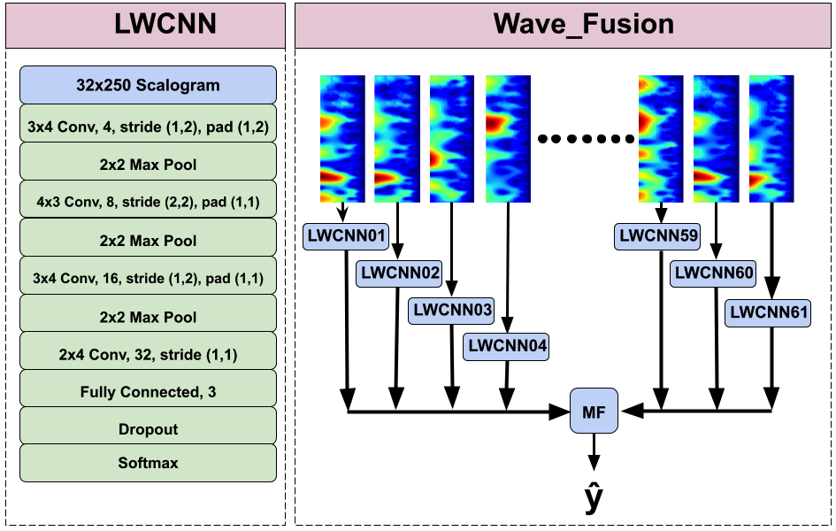

# WaveFusion: A Multiplicative Fusion of Lightweight Convolutional
Neural Networks for EEG Analysis
Official Implementation of the [WaveFusion Squeeze-and-Excitation: Towards an Accurate and Explainable Deep Learning Framework in Neuroscience](https://ieeexplore.ieee.org/document/9630605) presented at EMBC 2021.

<!--  -->

# Dataset
Retrieve the data [here](https://drive.google.com/drive/folders/1B9yLeR_dNSnT7wAm2Gstbwt29KavTXiT?usp=sharing) and save it to the same directory as main.py.

# Install MNE
This work requires MNE. After creating a virtual environment, download and install MNE:

wget "https://raw.githubusercontent.com/mne-tools/mne-python/master/requirements.txt"  
pip install -r "requirements.txt"  
pip install -U mne

# Example Run
 run 'pip install -r requirements.txt'.  

	python3 main.py

# Contact
If you have any questions, contact at mbriden@ucsc.edu
